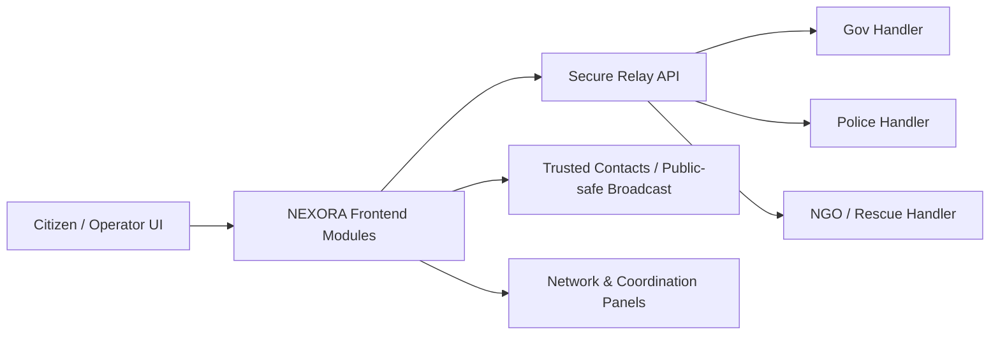

# NEXORA PRIME
### Real-time Emergency Intelligence Platform (Major Project)

[Live CloudFront](https://d3nn99bka7k1je.cloudfront.net)

NEXORA PRIME is a **real-use emergency workflow web platform** designed for situations where seconds matter:
- road accidents,
- violence/threat cases,
- unsafe cab movement,
- fire/flood/weather incidents,
- and district-level resource coordination.

It is built as a **multipage production-style UI project** with advanced graphics, calm UX, and practical emergency logic.

## Why this project is different
- One-tap emergency trigger with live location capture (after permission).
- Voice wake flow (`wake up rex`) for no-typing SOS mode.
- Continuous location updates during active incidents.
- Auto-routing logic to relevant response types (medical, fire, police, rescue, utility).
- Public-safe redacted broadcast support (area-level, not exact victim pin for public channels).
- Citizen + network + coordination views that share synchronized incident context.

## Quick understanding (simple flow)
1. Open Home (`index.html`) and select the emergency scenario.
2. Tap **One-Tap SOS (Auto)** or use voice wake mode.
3. App fetches current location, builds incident payload, and starts alert workflow.
4. Network/coordination modules help identify nearby resources and queue priority.
5. Trusted contacts get message-ready emergency text with location context.

## Multipage structure
- `index.html` -> Command Center + SOS console + Rex AI Assistant
- `community.html` -> Citizen reporting and guidance
- `network.html` -> Resource discovery and dispatch recommendations
- `coordination.html` -> Priority lanes and readiness allocation
- `styles.css` + `portal.css` -> shared premium UI system and per-page visual identity
- `app.js` + `portal.js` -> emergency logic, assistant flow, and cross-page state sync

## Core emergency capabilities
- Emergency scenario presets (accident / attack / cab risk)
- Trip Guard timer with auto-SOS fail-safe
- Voice SOS support (browser speech recognition dependent)
- Trusted contact save + rapid message generation
- Dispatch planning engine with district/resource matching
- Offline-aware PWA shell (`manifest.webmanifest`, `sw.js`)

## Security model (relay backend)
Relay backend (`relay-backend/`) includes:
- JWT auth endpoint (`/v1/auth/token`)
- role-based access controls
- signed relay event verification (HMAC, timestamp + nonce replay guard)
- connector fan-out model for gov/NGO/police integration paths

> Note: any real government/police integration requires official onboarding, legal approvals, and audited infrastructure. This project ships the integration-ready architecture and relay contract.

## Architecture snapshot


## Run locally
```bash
npm install
npm run check:js
npm run dev
```
Then open:
- [http://localhost:4174/index.html](http://localhost:4174/index.html)
- [http://localhost:4174/network.html](http://localhost:4174/network.html)
- [http://localhost:4174/community.html](http://localhost:4174/community.html)
- [http://localhost:4174/coordination.html](http://localhost:4174/coordination.html)

## Live options
### CloudFront (current)
- [https://d3nn99bka7k1je.cloudfront.net](https://d3nn99bka7k1je.cloudfront.net)

### Tunnel preview (free)
```bash
npm run live:start
npm run live:status
npm run live:stop
```

## Relay configuration
1. Copy `relay.config.example.js` to `relay.config.js`
2. Set endpoint/key values for your environment
3. Keep `relay.config.js` private (already gitignored)

Backend setup:
```bash
cd relay-backend
npm install
cp .env.example .env
npm run dev
```

## Project highlights for showcase/jury
- Premium 3D branding and cinematic but readable visual language
- Dark/light themes with per-page atmospheric backgrounds
- Accessibility-minded controls (focus states, reduced motion handling, high signal UI)
- Practical emergency-first interaction model (low-friction, low-input, fast actions)
- Multipage architecture with shared real-time context

## Important disclaimer
This project is an advanced emergency platform prototype and operational architecture showcase.  
For real public deployment, always integrate with officially verified emergency systems, legal compliance, and certified response organizations.
